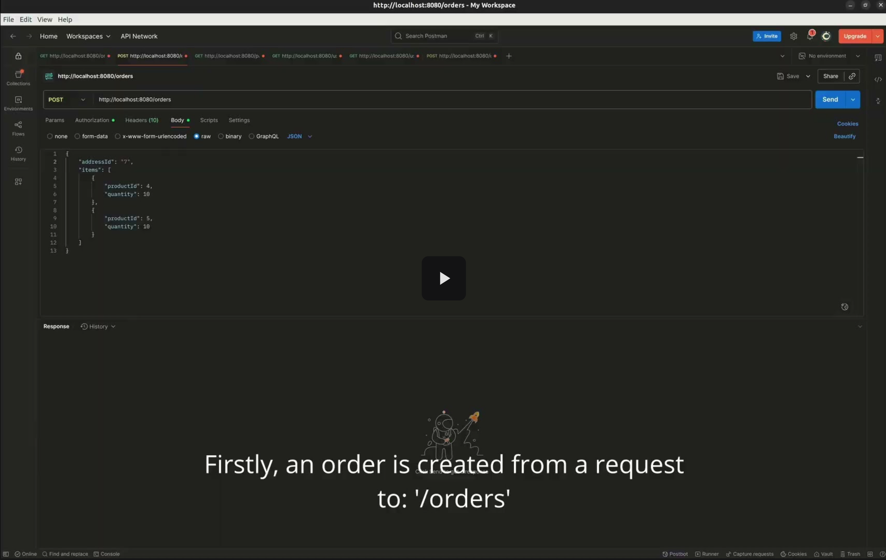

# Ecommerce Backend (Spring Boot)

Robust, production-oriented backend for an e-commerce platform implementing secure auth (password + OAuth2/OIDC), robust payment integration (VNPay redirect + IPN), resilient order & inventory lifecycle, RBAC authorization and disciplined testing (93 unit + 51 integration tests).  

Designed with clean architecture principles, defensive validation, rich error semantics, and maintainability in mind — built to showcase professional backend engineering craft.

---

## 🔥 TL;DR (For Fast Readers)

| Area | Highlights                                                                                                                           |
|------|--------------------------------------------------------------------------------------------------------------------------------------|
| Auth | Email/password + Google (OIDC), Facebook, GitHub OAuth2. Email verification & password reset tokens with anti-enumeration responses. |
| Payments | VNPay integration: redirect URL generation, IPN listener, secure return endpoint, idempotent status updates                          |
| Code Quality | Clean separation of concerns, validation & rich error responses, frequent refactors to maintain code clarity and extensibility       |
| Security | JWT (stateless), RBAC (USER / ADMIN), custom filter, global exception mapping, defensive error messages, duplication guards.         |
| Reliability | 93 unit + 51 integration tests; services & controllers covered. Edge cases covered                                                   |
| Observability | Structured logging around payment IPN & auth flows.                                                                                  |

---

## 🎬 Demo
- Videos with subtitles explaining what is going on. Endpoints are hit using Postman.
- Many edge cases have been handled but can't show due to prolonging video lengths.

### OAuth2 Sign-In (GitHub & Facebook & Google)
[](https://drive.google.com/file/d/1FH7I7qQWKL1Au9bV8KD7n6fWCAtiiABk/view?usp=drive_link)
- Users authorize using the providers, and the backend will create/link a new account using the credentials provided by the providers.

### VNPay Payment Flow
[](https://drive.google.com/file/d/1YdHgsmNr6QNwYaXp_zpO1DfWkXtCE-9m/view?usp=drive_link)
- Sequence: Generate redirect → VNPay sandbox → return URL JSON → IPN logs.

### Scheduler For Order/Payment Cleaning & Inventory Release
[](https://drive.google.com/file/d/1Jkgq846xC9FtCZ4F-P4002_lJsLh7XvP/view?usp=drive_link)
- Inventory is decremented after ordering. If the order is unsuccessful, the products get released back into the inventory.

### Email Service
[](https://drive.google.com/file/d/1BypevKXB1dLcV4Y6magk_yjPYxJo8X1R/view?usp=drive_link)
- An email is sent after account creation for email verification. Users can't login with an unverified email.
- Emails are also sent for password resetting requests.

### Thorough testing
[](https://drive.google.com/file/d/1aDUHPhIPLXed3YhhRp_RlnAL_n7lnJ0Q/view?usp=drive_link)
- 144 Tests with 93 unit and 51 integration tests. If any feature fails, we will know from these tests.

---

## ✅ Quality & CI
 

(Generated on each main branch build)

---

## 🧰 Tech Stack

| Category | Choice                                                           |
|----------|------------------------------------------------------------------|
| Language | Java                                                             |
| Framework | Spring Boot (Web, Security, Data JPA, Scheduling, OAuth2 Client) |
| Auth | JWT (custom service), OAuth2/OIDC providers                      |
| Persistence | PostGreSQL                                                       |
| Build | Maven                                 |
| Tests | JUnit, Spring Test, (Mocks for external calls)                   |
| Security | BCryptPasswordEncoder                                            |
| Email | SMTP-backed EmailService                                         |
| Payments | VNPay integration (custom signature + IPN handling)              |

---

### Core Domains

- Authentication & Identity (registration, verification, login, OAuth2/OIDC, password reset)
- Users & Addresses (ownership + duplication rules + RBAC admin overrides)
- Products (CRUD, quantity patching, listing)
- Orders (lifecycle, expiry, inventory restoration)
- Payments (VNPay integration; IPN & return handling; status transitions)
- Administration (User + Product management)
- Infrastructure Services (EmailService, JwtService, TokenService, EncryptionService)
- Scheduling (expire Orders + Payments, release inventory atomically)

---

## 🚀 Quick Start

```bash
# 1. Clone
git clone https://github.com/LiuChangMing88/ecommerce-backend.git
cd ecommerce-backend

# 2. Configure environment
# Check below

# 3. Run database on port 5432 (example using Docker)
docker run -d --name pg -e POSTGRES_PASSWORD=pass -e POSTGRES_DB=ecommerce -p 5432:5432 postgres:16

# 4. Run SMPT4dev 
docker run -d --name smtp4dev -p 25:25 -p 5000:80 rnwood/smtp4dev:latest

# 5. Start app
./mvnw spring-boot:run   #

# 6. Run tests
./mvnw test              #
```

Environment Variables (sample – adapt):
```
DB_URL=jdbc:postgresql://localhost:5432/ecommerce
DB_USER=...
DB_PASS=...
JWT_SECRET=...
OAUTH_GOOGLE_CLIENT_ID=...
OAUTH_GOOGLE_CLIENT_SECRET=...
SMTP_HOST=...
SMTP_USER=...
SMTP_PASS=...
payment.vnpay.pay-url=...
payment.vnpay.return-url=...
payment.vnpay.version=...
payment.vnpay.command=...
payment.vnpay.curr-code=...
payment.vnpay.locale=...
payment.vnpay.order-type=...
payment.vnpay.tmn-code=${VNP_TMNCODE}
payment.vnpay.hash-secret=${VNP_HASHSECRET}
...
```

---

## 🧵 REST API Endpoint Summary

Legend:
- Auth: Public = no authentication; USER = requires authenticated user with role USER; ADMIN = requires role ADMIN.
- Body DTO: Name of the request body object (JSON). (Path / query parameters listed separately.)
- Responses list primary success status + representative DTO / payload (abbreviated).

### 🔐 Authentication & Account

| Method | Path | Auth | Query Params | Body DTO | Success Response | Description |
|--------|------|------|--------------|----------|------------------|-------------|
| POST | /auth/register | Public | – | RegistrationRequest | 200 OK, RegistrationResponse | Register a new user; sends verification email + token. |
| POST | /auth/login | Public | – | LoginRequest | 200 OK, LoginResponse (jwt) | Authenticate user (must be verified or resend verification logic). |
| GET | /auth/verify | Public | token | – | 200 OK, "User has been verified!" | Verify email using verification token. |
| POST | /auth/forgot-password | Public | – | ForgotPasswordRequest | 200 OK, generic message | Initiate password reset (non‑enumerating response). |
| GET | /auth/reset-password | Public | token | – | 200 OK, "The token is valid" | Validate reset token without changing password. |
| POST | /auth/reset-password | Public | token | ResetPasswordRequest | 200 OK, success message | Perform password reset (token + new passwords). |

### 👤 User (Self-Service)

(All require USER role)

| Method | Path | Auth | Path Params | Body DTO | Success Response | Description |
|--------|------|------|-------------|----------|------------------|-------------|
| GET | /users/profile | USER | – | – | 200 OK, RegistrationResponse (subset) | Get current authenticated user’s profile. |
| GET | /users/addresses | USER | – | – | 200 OK, List<AddressResponse> | List user’s saved addresses. |
| POST | /users/addresses | USER | – | AddressUpdateRequest | 201 Created, AddressResponse | Create a new address (duplicate check). |
| PUT | /users/addresses/{addressId} | USER | addressId | AddressUpdateRequest | 200 OK, AddressResponse | Update an existing address (duplicate check). |
| DELETE | /users/addresses/{addressId} | USER | addressId | – | 204 No Content | Delete an address. |

### 🛒 Admin – Products

(All require ADMIN role)

| Method | Path | Auth | Path Params | Body DTO | Success Response | Description |
|--------|------|------|-------------|----------|------------------|-------------|
| POST | /admins/products | ADMIN | – | ProductRequest | 201 Created, ProductResponse | Create a product. |
| PUT | /admins/products/{productId} | ADMIN | productId | ProductRequest | 200 OK, ProductResponse | Update full product details. |
| DELETE | /admins/products/{productId} | ADMIN | productId | – | 204 No Content | Delete a product. |
| PATCH | /admins/products/{productId}/quantity | ADMIN | productId | ProductQuantityUpdateRequest | 200 OK, ProductResponse | Update only product quantity (frequent stock adjustments). |

### 🧑‍💼 Admin – Users & Addresses

(All require ADMIN role)

| Method | Path | Auth | Path Params | Body DTO | Success Response | Description |
|--------|------|------|-------------|----------|------------------|-------------|
| GET | /admins/users/{userId}/profile | ADMIN | userId | – | 200 OK, RegistrationResponse | Retrieve a user’s profile. |
| GET | /admins/users/{userId}/addresses | ADMIN | userId | – | 200 OK, List<AddressResponse> | List addresses for a user. |
| POST | /admins/users/{userId}/addresses | ADMIN | userId | AddressUpdateRequest | 201 Created, AddressResponse | Add address to user (duplicate check). |
| PUT | /admins/users/{userId}/addresses/{addressId} | ADMIN | userId, addressId | AddressUpdateRequest | 200 OK, AddressResponse | Update a specific address. |
| DELETE | /admins/users/{userId}/addresses/{addressId} | ADMIN | userId, addressId | – | 204 No Content | Delete user’s address. |

### 🛍 Products (Public Catalog)

| Method | Path | Auth | Path Params | Body DTO | Success Response | Description |
|--------|------|------|-------------|----------|------------------|-------------|
| GET | /products | Public | – | – | 200 OK, List<ProductResponse> | Get all products (for listing page). |
| GET | /products/{productId} | Public | productId | – | 200 OK, ProductResponse | Get a single product by ID. |

### 📦 Orders

| Method | Path | Auth | Path Params | Body DTO | Success Response | Description |
|--------|------|------|-------------|----------|------------------|-------------|
| GET | /orders | USER | – | – | 200 OK, List<OrderResponse> | Retrieve all orders of the authenticated user. |
| POST | /orders | USER | – | CreateOrderRequest | 201 Created (Location header), OrderResponse | Create an order (reserves stock / prepares for payment). |

### 💳 Payments – VNPay

| Method | Path | Auth | Path Params | Query / Form | Body DTO | Success Response | Description |
|--------|------|------|-------------|--------------|----------|------------------|-------------|
| GET | /payments/vnpay/pay/{orderId} | USER | orderId | – | – | 200 OK, PayResponse | Initiate or reuse a VNPay payment; returns redirect data/URL. |
| GET | /payments/vnpay/ipn | Public (VNPay server) | – | Dynamic VNPay params | – | 200 OK, IpnResponse | IPN callback endpoint (signature + status handling). |
| GET | /payments/vnpay/return | Public | – | Dynamic VNPay params | – | 200 OK, Map<String,String> | Return URL for user; reports signature validity + key fields. |

### 📝 Notes & Conventions

| Aspect | Detail |
|--------|--------|
| Authentication | JWT-based; ROLE_USER / ROLE_ADMIN gating with `@PreAuthorize`. |
| Status Codes | 200 for successful reads/updates; 201 for resource creation; 204 for deletions. |
| Validation | `@Valid` on request DTOs triggers Bean Validation (400 on constraint violations). |
| Error Handling | Centralized Global Exception Handler returns structured error messages. |
| Security | Admin endpoints segregated under `/admins/**`; user self-service under `/users/**`. |
| Idempotency / Payments | VNPay IPN processed with signature verification; order/payment state transitions guarded in services. |
| Creation Location Header | POST /orders returns `Location: /orders/{id}`. |
| Password Flows | Forgot/reset endpoints avoid email enumeration. |
| Token Endpoints | Verification & reset tokens passed via query string (`token` param). |

### 📄 Representative DTOs (Abbreviated Names Only)

| Purpose | DTO |
|---------|-----|
| Register | RegistrationRequest / RegistrationResponse |
| Login | LoginRequest / LoginResponse |
| Password Reset | ForgotPasswordRequest / ResetPasswordRequest |
| Product | ProductRequest / ProductResponse / ProductQuantityUpdateRequest |
| User Address | AddressUpdateRequest / AddressResponse |
| Orders | CreateOrderRequest / OrderResponse |
| Payments | PayResponse / IpnResponse |

> For full schema, see the corresponding model / DTO classes in the codebase.

---

## 🗂 Repository Hygiene

- Clean commit history grouped by feature/refactor.
- Separate directories for domain areas; eliminated “kitchen sink” service/model sprawl.
- Explicit naming (e.g., PaymentStatus, OrderStatus) clarifies state transitions.

---

> “Production mindset in a portfolio context: correctness first, clarity second, extensibility third.”